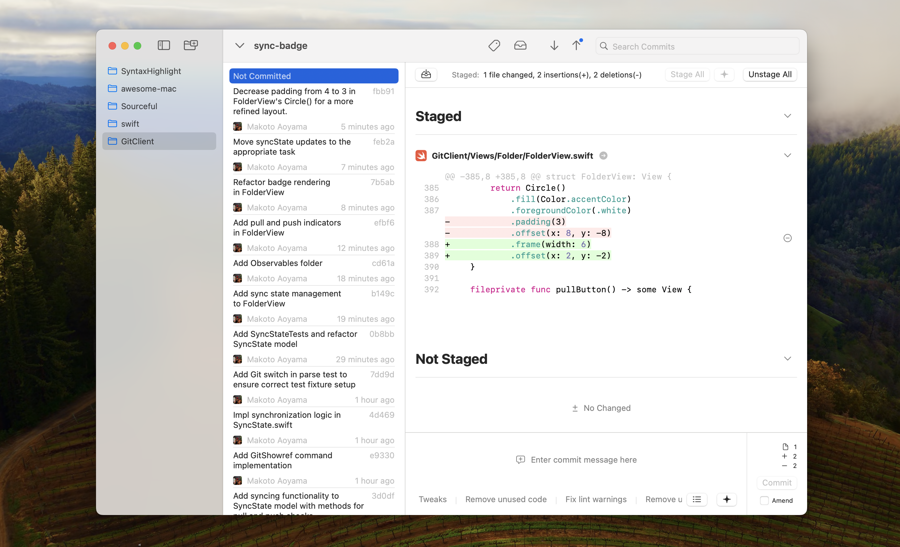
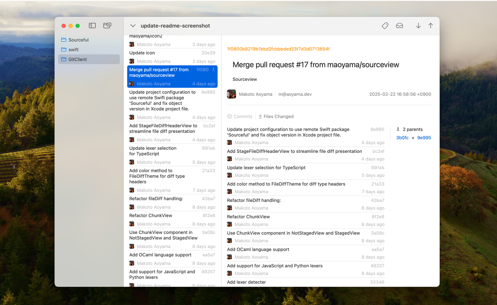
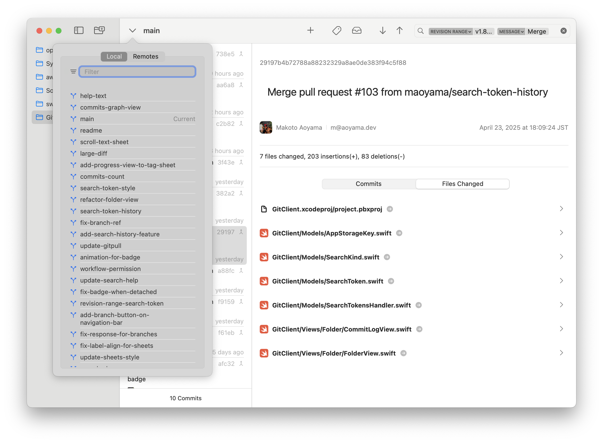

# Tempo - GUI Git Client

A Mac app that is a GUI Git client, written in SwiftUI and AppKit.  
Tempo.app replaces CLI-based Git operations with a Mac-specific, clear GUI.  
Instead of typing numerous commands, you can focus on coding while effortlessly managing Git tasks with simple button clicks.

By setting the OpenAI API secret key in the app, you can generate commit messages and perform staging by hunk using the OpenAI API. Since this app utilizes GPT-4o-mini, it remains relatively inexpensive, allowing you to use it without worrying too much about costs (the API is priced at 15 cents per 1M input tokens and 60 cents per 1M output tokens).

## Features

This app provides the following Git features:
- Commit
    - Amend
    - Commit Message Snippets
    - Revert
    - Checkout
- Add
    - Stage by Hunk
- Branch
    - Push
    - Pull
    - Merge
    - Create
    - Filter
- Tag
    - Create & Push
    - Delete
    - Filter
- Stash
    - Apply
- Search Commits
    - Commit Message
    - Changed(added/removed)
    - Author
    - Revision Range

## Installation

Download the latest [release](https://github.com/maoyama/Tempo/releases), unzip, and run Tempo.app.

